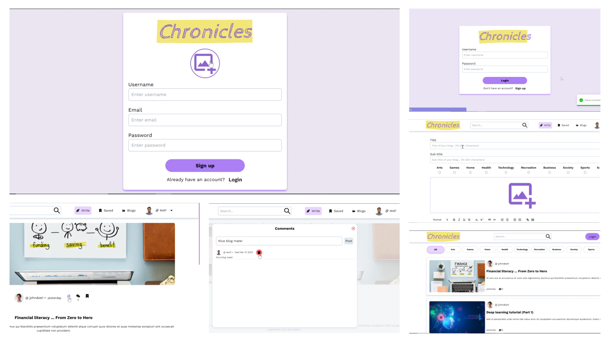
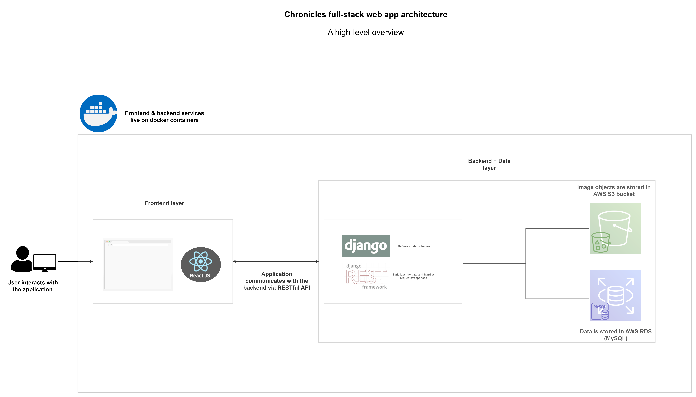
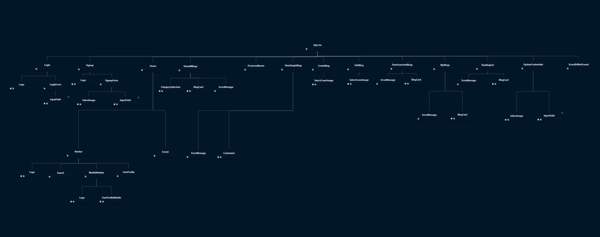
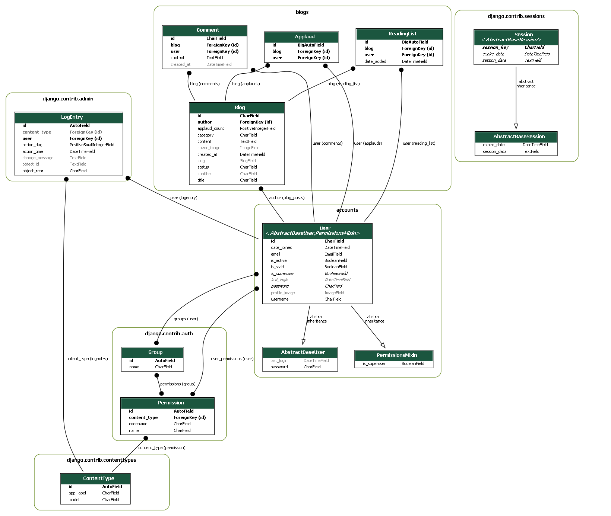

# Chronicles

## Table of contents

1. [Description](#description)
2. [Demo](#demo)
3. [Screenshots](#screenshots)
4. [Architecture Overview](#architecture-overview)
5. [API Documentation](#api-documentation)
6. [Frontend Component Tree Visualized](#component-tree)
7. [ERD Visualized](#erd-vis)
8. [Installation and Usage](#installation-usage)

## Description 

It is a full-stack blog web application built with React on the frontend and Django/DRF on the backend integrated with AWS-S3 & AWS-RDS services.

<ins>Features:</ins>

- JWT authentication and authorization
- Responsive layout
- Users:
  - Users can:
    - Signup
    - Login
    - Logout
    - Update their email, password or profile picture
    - Delete their account
  - Currently loggedin user info is displayed on the home page
- Blog posts:
  - Users can:
    - Create a post
    - Edit their post
    - Delete their post
    - Applaud a post i.e. like/unlike a post
    - Comment on the post
    - Delete their comment
    - Save/unsave a post to their reading list
    - Save their draft and come back later to publish it
  - Category-wise blogs filtering on the home page
    - the categories supported are _arts, games, home, health, technology, recreation, business, society, sports, science_
  - Pagination of blogs
  - Search functionality i.e. search a blog by its title
  - A rich text editor for writing a blog

## Demo 

Check the video demo at [https://youtu.be/70gXH6j7XtQ](https://youtu.be/70gXH6j7XtQ)

## Screenshots 

## Architecture Overview 

## API Documentation 

All the endpoints are listed below. However, to view the details of the endpoints, visit [Chronicles Api Docs](https://documenter.getpostman.com/view/25138891/2s935oL3mZ).

- <ins>Users</ins>:

  - `api/users/user/signup/` - POST
  - `api/users/user/login/token/` - POST
  - `api/users/user/login/token/refresh/` - POST
  - `api/users/all/` - GET
  - `api/users/user/` - GET, PUT, DELETE

- <ins>Blogs</ins>:

  - `api/blogs/blogpost/` - POST
  - `api/blogs/all/` - GET
  - `api/blogs/blog/{blogId}/` - GET, PUT, DELETE
  - `api/blogs/userblogs/` - GET

- <ins>Comments</ins>:

  - `api/blogs/blog/{blogId}/commentpost/` - POST
  - `api/blogs/blog/{blogId}/comments/all/` - GET
  - `api/blogs/blog/{blogId}/comment/{commentId}/` - PUT, DELETE
  - `api/blogs/blog/{blogId}/totalcomments/` - GET

- <ins>Applauds</ins>:

  - `api/blogs/blog/{blogId}/applaud/` - POST
  - `api/blogs/blog/{blogId}/applauder/exists/` - GET

- <ins>Reading-list</ins>:
  - `api/blogs/blog/{blogId}/readinglist/save/` - POST
  - `api/blogs/readinglist/all/` - GET
  - `api/blogs/blog/{blogId}/reader/exists/` - GET

## Frontend Component Tree Visualized 

## ERD Visualized 

## Installation and Usage 

#### <ins>**General**</ins>

- Requirements:
  - `node >= 16.14.0`
  - `npm >= 8.3.1`
  - `python >= 3.8`
  - `pip >= 21.3.1`
  - `AWS account` - if you want to use AWS
  - Setup variables in the `backend\config.py` file to encapsulate all your secret-keys related to AWS. 
- `git clone https://github.com/AI-14/chronicles.git` - clones the repository
- `cd chronicles`

> NOTE: If you want to use local machine for image uploads rather than AWS-S3, then remove all the configs in `backend\core\settings.py` under `# AWS-S3`. Then in `backend\core\urls.py`, add this line `urlpatterns += static(settings.MEDIA_URL, document_root=settings.MEDIA_ROOT)`. With this setting, images will be stored under `backend\media\`.

#### <ins>**For frontend folder**</ins>

- Setup the project as per _General_ sub-section
- `cd frontend`
- `npm install` or `npm i` - installs all packages
- `npm install --save-dev` - installs devDependencies
- `npm start` - starts the app

#### <ins>**For backend folder**</ins>

- Setup the project as per _General_ sub-section
- `cd backend`
- `py -m venv yourVenvName` - creates a virtual environment
- `yourVenvName\Scripts\activate.bat` - activates the virtual environment
- `pip install -r requirements.txt` - installs all modules
- `python manage.py makemigrations` & `python manage.py migrate` - migrates all the tables to db
- `python manage.py createsuperuser` - creates a superuser
- `python manage.py runserver` - runs the server

> NOTE: First run backend server (it will run on `http://127.0.0.1:8000`), then run frontend app (it will run on `http://127.0.0.1:3000`)

#### <ins>**Makefile**</ins>

You need to have `make` installed in your machine

- Setup the project as per _General_ sub-section
- `make build-backend` - builds the backend
- `make build-frontend` - builds the frontend
- `make run-backend` - runs the backend
- `make run-frontend` - runs the frontend (make sure you open another cmd to run this command)

> NOTE: Use `make help` to see all the commands

#### <ins>**Docker**<ins/>

You need to have `Docker` installed in your machine

- Setup the project as per _General_ sub-section
- `docker-compose build` - build the images for both frontend and backend
- `docker-compose up` - runs the containers

> NOTE: To setup docker dev-env, include volumes in the `docker-compose.yaml`
